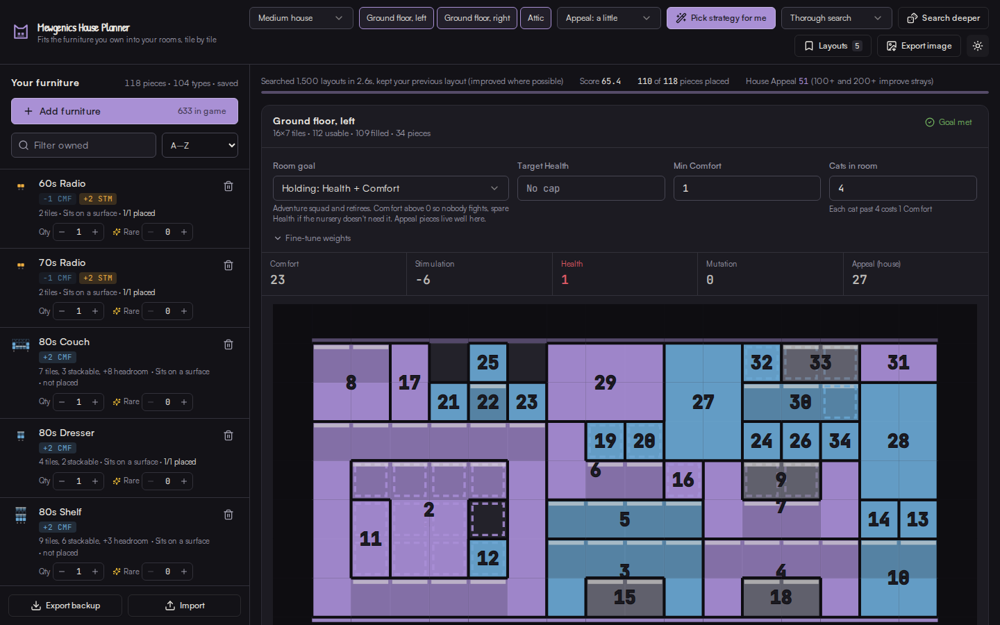
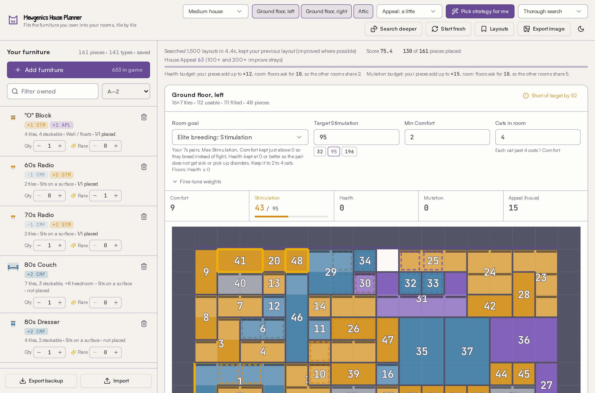

# Mewgenics House Planner

Tell it what furniture you own, pick your rooms and what each room is for, and it packs everything in tile by tile, in the order you should place it in the game.

- https://notalim.github.io/mewgenics-house-planner/ (runs entirely in your browser, nothing is uploaded; move data between devices with Export backup and Import)
- https://github.com/notalim/mewgenics-house-planner (this repo, MIT)

## Why

The house is a great part of Mewgenics, but every new piece of furniture meant the same thing: open furniture mode, shuffle pieces between rooms, try to squeeze one more Stimulation onto a shelf, lose the Comfort floor, start over. I am the kind of player who cannot leave a room at 51 when 55 is possible, and I did not want to do that by hand every single evening.

So I wrote something that does it for me. You keep the fun parts (deciding which room breeds, which room fights, which cat goes where) and the planner does the Tetris. It is made to make your life easier, not to play the game for you. I play on PS5, so it had to work with a typed-in list, not just a save file.

## What it does

- Knows all 633 furniture pieces: shape, headroom, what each can rest on, stats, whether it can be rare. Knows the real room grids, including the sloped attic roof that nothing can hang from.
- Places pieces the way the game allows: on the floor, on shelves and tables, hanging from the ceiling, with the right clearance.
- Splits your furniture across rooms to get the most out of a goal per room: elite breeding, feeder nursery, fight club, holding, or your own weights and floors. Minimum Comfort, Health, Mutation and Stimulation are hard floors, so a room never dips below what you asked for when the pieces exist.
- Shows each room with placement numbers, so you build from 1 upward and every shelf exists before the thing that sits on it. Hover any piece for its stats and what it rests on.
- Explains what it left in storage and why, and shows a budget line when a stat is scarce (for example "Health: your pieces add up to +12, floors ask for 10").
- Keeps your layout stable. Adding one piece changes one cell, not the whole house. Save the house you built under Layouts and the Changes panel lists exactly which pieces to move after any recompute.
- Imports a Steam save (`steamcampaign01.sav`) including which pieces are rare, or a JSON backup. Console players type pieces in with a fast search box.
- Exports the whole house as one PNG.

## How to use it

1. Add your furniture. PC: press Import and choose your save (Windows: `%AppData%\Glaiel Games\Mewgenics\<SteamID>\saves\steamcampaign01.sav`). It shows a preview before replacing your list. Console: Add furniture, type a name, use the Rare toggle for golden pieces.
2. Pick your house stage and which rooms are unlocked.
3. Give each room a goal, or press "Pick strategy for me" and it tries every way of assigning roles to rooms and keeps the best.
4. Build the rooms from the grids. Numbers are placement order.
5. Save the layout under Layouts. From then on, every time you add a piece, the Changes panel tells you the few moves to make.

## How the optimizer works, in short

It is a search, not a plain greedy fill.

1. Every layout gets a score: weighted room stats against each room's goal, with penalties for breaking a floor, plus a small house-wide Appeal term.
2. A first layout is built greedily, best score per tile first, big floor pieces before small ones so shelves exist before the things that sit on them.
3. Then it runs thousands of rounds of ruin and repack: tear out part of a room (a random handful, a vertical band, one furniture set, the biggest piece, or a swap between two rooms), rebuild it, keep the result if it scores better. Early rounds sometimes accept a slightly worse layout so the search can leave dead ends (simulated annealing).
4. A finishing pass moves small pieces aside so stranded single tiles merge and one more leftover fits.
5. Your previous layout is one of the starting points and wins unless a change pays for the pieces you would have to move. Random numbers are seeded, so the same inventory and goals give the same layout on every device.

It is a strong heuristic, not an exact solver, but on a 160-piece inventory it lands within a couple of points of what the stats alone would allow if geometry did not exist.

## Running it yourself

Requires Node 20+.

- `npm run build:static` builds the browser-only version into `dist/public` (localStorage plus sql.js for save files). This is what GitHub Pages serves.
- `npm run build` builds the same client plus a small Express server (`dist/index.cjs`, SQLite file `data.db`) for a shared house across devices. `NODE_ENV=production node dist/index.cjs`, port 5000. No accounts: anyone with the URL shares the inventory.
- `npm run dev` for development.

## Contributing

Issues and pull requests are welcome. I do not know everything about the house mechanics, the game keeps updating, and I only have one console save to test against, so corrections to furniture data, placement rules or breeding facts are as useful as code. Good first things to look at: furniture that places wrong, a goal preset that does not match how people actually use a room, or a save file that imports strangely.

## Data sources and thanks

- Furniture stats and room grids come from the game's data files as published in the community save editor: https://github.com/michael-trinity/mewgenics-savegame-editor
- Save file layout: https://github.com/michael-trinity/mewgenics-savegame-editor and https://github.com/kazzade42/mewgenics-furniture-upgrade. The rarity flag was worked out by the Breeding Manager fork: https://github.com/whyayala/MewgenicsBreedingManager
- Placement rules and room mechanics: https://mewgenicswiki.org/articles/house-furniture-guide and https://steamcommunity.com/app/686060/discussions/0/760682265019693246/
- Food Storage Box effect: https://nerdschalk.com/mewgenics-all-tracy-upgrades-blank-collar-food-box-and-furniture-idols/

Basements exist in the game's data with an upgrade chain but nothing unlocks them in play, so they are hidden.

## Credits

Built by [notalim](https://github.com/notalim). Fan project, not affiliated with Glaiel Games or Edmund McMillen. Mewgenics and its furniture names belong to their owners. MIT licensed, see LICENSE.
